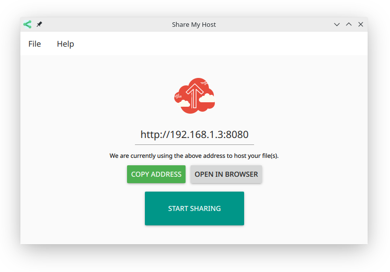
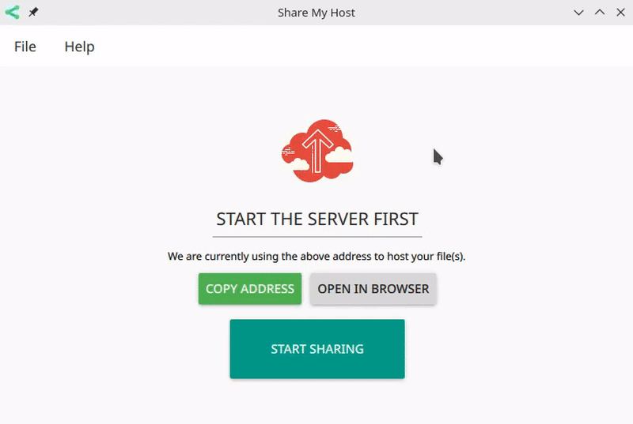
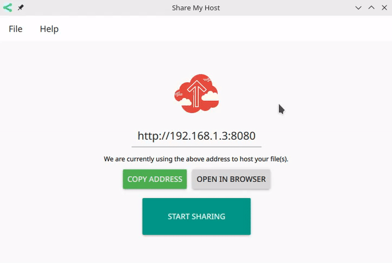
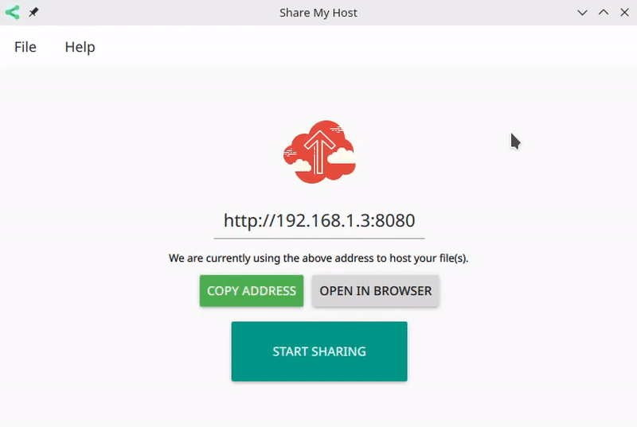

<h1 align="center">Share My Host</h1>
<p align="center">
    
    
    
    
    <a class="badge-align" href="https://travis-ci.org/antony-jr/ShareMyHost"> </a>
</p>

<p align="center">
<table>
  <tr>
    <th >Download<br></th>
    <th >Execute</th>
  </tr>
  <tr>
    <td >
    <a href="https://github.com/antony-jr/ShareMyHost/releases/tag/continuous">
    
    </a>
    </td>
    <td ><b>chmod</b> +x ShareMyHost*-x86_64.AppImage &amp;&amp; ./ShareMyHost*-x86_64.AppImage<br></td>
  </tr>
</table>
</p>


<p align="center">
    <br>
</p>


**ShareMyHost** is a simple and powerful program written in C++/QML using Google's material 
design guidelines. It gives a *very simple http server for sharing file(s) within your
local network*. It uses **mount points** which are sort of like http endpoints with directory
listing to specific directories in your file system.

For example, You create a **Mount Point**(say /Animes to /home/user/Anime) then you can access
the directory listing and all its files at ```http://ip:port/Animes``` (Ex: http://192.168.1.3:8080/Animes).

See down below for the usage.

# Usage

### Starting the server

<p align="center">
    
  <br>
</p>

### Adding Mount Point


<p align="center">
    
  <br>
</p>

### Removing Mount Point

<p align="center">
    
  <br>
</p>


# Support 

If you think that this project is **cool** then you can give it a :star: or :fork_and_knife: it if you want to improve it with me. I really :heart: stars though!   

You can also tweet about me on twitter , get connected with me [@antonyjr0](https://twitter.com/antonyjr0)

Thank You! :smiley_cat:

# Icons

All icons used in this program except the GPLV3 logo has been made by [Icons8](https://icons8.com). 


# License

The GNU General Public License V3.

Copyright (C) Antony Jr.
